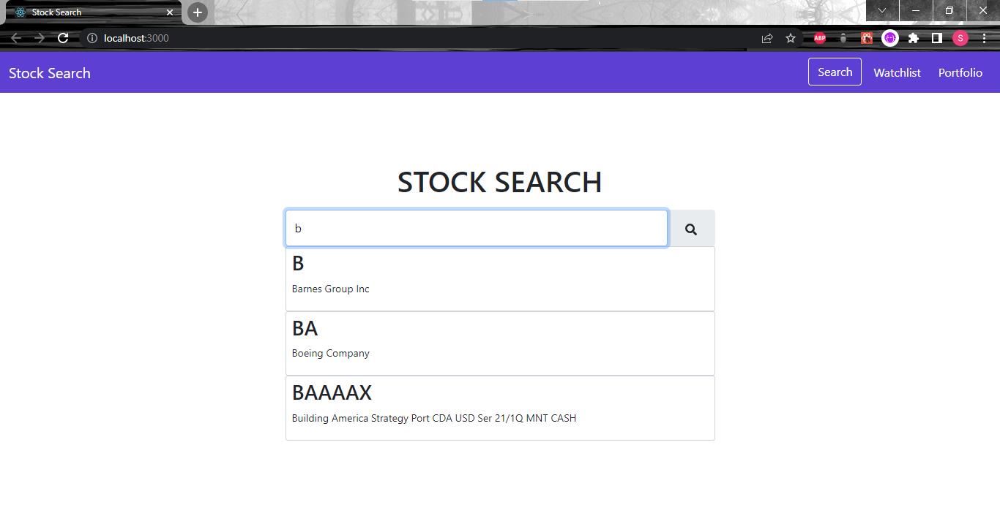

# Stock_Search_Project
•	Developed a responsive web app for searching and buying stocks. An autosuggestion feature for searching stocks to improve user efficiency. 
•	Implemented frontend features such as watch listing a stock, buying and selling stocks using React to improve user experience and backend was coded in NodeJS.

# Home

# Watchlist

# Portfolio

